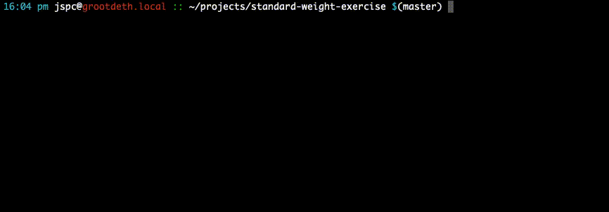

# Standard Weight Exercise

This project contains a solution, in go, for the Standard Weight Exercise. It includes a fully working solution, and a series of test cases.

It requires [go](https://golang.org/), which can be installed [here](https://golang.org/dl/) (specifically: [for windows](https://golang.org/dl/go1.15.6.windows-amd64.msi), or [for mac](https://golang.org/dl/go1.15.6.darwin-amd64.pkg))

## Running the program

1. Install go from one of the links above
2. Compile the program with `go build`
3. Run the resultant binary `./standard-weight-exercise`

## Testing

1. Install go from one of the links above
2. Run `go test -v` from within the folder this code is checked out into
